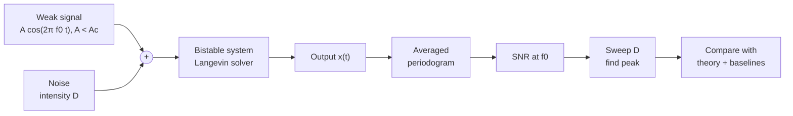
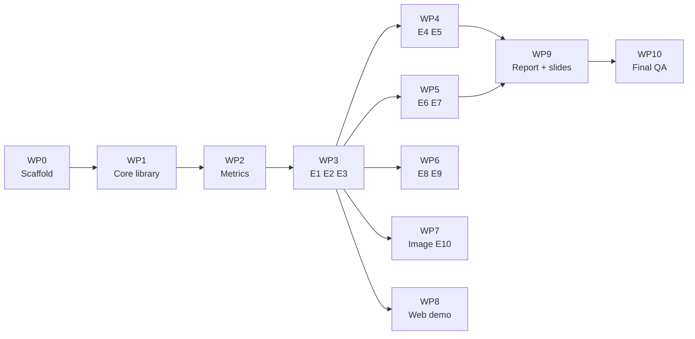

# Stochastic Resonance Project — Plan, Design & Cowork Task Assignments

2026-09-18 · @Someone

## 1. Project at a glance

The project is done when one figure shows output SNR rising, peaking, then falling as noise intensity D increases, with the peak near the theoretical value. Every other task supports or extends that figure.

| Deliverable | From proposal | Done when |
| --- | --- | --- |
| SNR-vs-noise curve with a clear peak | Outcome 1, criterion 4 | Peak visible with error bars over 20+ trials; peak location within about 30% of theory |
| Before/after signal figure | Outcome 2 | Three panels: too little, optimal, and too much noise |
| Detection comparison | Criterion 5 | ROC AUC and Pd at Pfa = 5% versus D, against the no-SR detector |
| Baseline comparison | Criterion 6 | SR versus the same detector with no added noise, and versus a linear filter |
| Low-light image demo (extension) | Outcome 3, criterion 7 | One image: SR versus histogram EQ versus gamma, with metrics |
| Report and slides | Plan row 5 | Every figure regenerates from a script with a fixed seed |

I recommend two additions beyond the proposal.

- **Threshold-detector SR.** It matches the proposal's "below the detector threshold" wording and reference \[5\]. It runs in seconds and is a safe fallback if the Langevin sweep misbehaves.
- **Parameter-tuned SR.** The proposal says the input is already noisy. When input noise is fixed, you tune the system (a, b) instead of the noise. This keeps the "low-SNR input" story consistent.

To use this with Cowork: export this doc as Markdown, save it as `PLAN.md` in the project folder, and run one work package per session in the order of section 5.

## 2. Technical design

The core is an overdamped particle in a double-well potential, driven by a weak sine plus white noise, solved numerically and scored in the frequency domain.



The same signal and noise generators feed every experiment; only the block between the adder and the output changes (bistable, threshold detector, or linear filter).

### 2.1 Model

Langevin equation: `dx/dt = a x - b x^3 + A cos(2π f0 t) + sqrt(2D) ξ(t)`, where ξ is unit white Gaussian noise.

| Quantity | Formula | Value at a = b = 1 |
| --- | --- | --- |
| Potential | U(x) = -a x^2/2 + b x^4/4 | double well |
| Well positions | x\_m = ± sqrt(a/b) | ± 1 |
| Barrier height | ΔU = a^2 / (4b) | 0.25 |
| Static threshold amplitude | A\_c = sqrt(4 a^3 / (27 b)) | about 0.385 |
| Kramers rate | r\_K = a / (sqrt(2) π) · exp(-ΔU / D) | 0.225 · exp(-0.25/D) |
| Two-state SNR (McNamara-Wiesenfeld) | SNR ≈ π (A x\_m / D)^2 · r\_K | peaks at D = ΔU/2 = 0.125 |

The signal is sub-threshold when A < A\_c: without noise the particle never leaves its well. The theory row gives the target for validation: the simulated peak should sit near D = 0.1 to 0.15. Cowork should verify the SNR formula's prefactor against reference \[3\] before plotting it.

### 2.2 Baseline parameters

| Parameter | Baseline | Sweep range |
| --- | --- | --- |
| a, b | 1, 1 | a from 0.2 to 3 (parameter-tuned experiment) |
| A | 0.3 (78% of A\_c) | 0.1, 0.2, 0.3 |
| f0 | 0.01 (period T = 100) | 0.005, 0.01, 0.02, 0.05 |
| D | none | 40 log-spaced values from 0.01 to 2 |
| Solver step dt | 0.01 | check 0.005 gives the same curve |
| Recording | every 10th step (fs = 10) | fixed |
| Duration | 128 full periods after 10 discarded periods | fixed |
| Trials per D | 20, different seeds | 50 for the final figure |

f0 must stay far below the in-well relaxation rate (2a), or the two-state theory stops applying. The duration is an exact number of periods so f0 falls on one FFT bin with no leakage.

### 2.3 Solver

- Euler-Maruyama step: `x += (a*x - b*x**3 + A*cos(2π f0 t)) * dt + sqrt(2*D*dt) * randn()`.
- Vectorise over the ensemble axis: one NumPy array holds all trials and all D values, stepped together. About 1.3 million steps on an 800-element array takes well under a minute.
- Store only the decimated output in float32. Never store full-rate trajectories for the whole sweep.
- Implement Heun (stochastic RK2) as an option and show both give the same SNR curve. That is the numerical-accuracy check for the report.
- Initial condition: random ±x\_m per trial. Discard the first 10 periods.

### 2.4 SNR measurement

1. Compute the periodogram of each trial's output, then average periodograms across trials.
2. Signal power S = value at the f0 bin, minus the background.
3. Background N = median of bins f0 ± 3 to f0 ± 25, excluding f0 ± 1.
4. SNR\_out = 10 log10(S / N) in dB. Get error bars by bootstrapping over trials.
5. Apply the identical estimator to the raw input (signal plus discretised noise) to get SNR\_in. Report gain = SNR\_out - SNR\_in, but make the peak in SNR\_out the main claim.

For pulse or aperiodic inputs, SNR at one frequency is the wrong metric. Use the peak cross-correlation coefficient between the clean input and the output instead.

### 2.5 Other system blocks

- **Threshold detector:** `y = 1 if s(t) + noise > θ else 0`, with A < θ. Noise here is Gaussian with standard deviation σ. Same SNR estimator on y.
- **Parameter-tuned SR:** input = signal + fixed noise D\_in. Sweep a (with b = a, so wells stay at ±1 and ΔU = a/4). SNR\_out peaks where ΔU ≈ 2 D\_in.
- **Linear baseline:** narrow band-pass or plain FFT of the raw input at f0. For white Gaussian noise this is near-optimal and will usually beat SR. Say so in the report; the honest claim is that noise helps a *nonlinear threshold-type detector*, not that SR beats linear filtering.

## 3. Repository layout and conventions

One small Python package holds all reusable code; each experiment is a thin script that imports it, so Cowork never duplicates the solver or the SNR estimator.

```
sr-project/
  PLAN.md               this document
  PROGRESS.md           Cowork appends a dated entry after every work package
  README.md             how to install and reproduce every figure
  requirements.txt      numpy scipy matplotlib opencv-python scikit-image pytest pyyaml
  configs/default.yaml  baseline parameters from section 2.2
  src/srlab/
    signals.py          sine, pulse train, white noise, seeded generators
    bistable.py         vectorised Langevin solver (Euler-Maruyama, Heun)
    threshold.py        threshold-detector system
    metrics.py          periodogram SNR, cross-correlation, ROC / AUC
    theory.py           A_c, barrier, Kramers rate, two-state SNR
    sweep.py            generic sweep runner with caching to results/
    image_sr.py         image extension
    plotting.py         shared figure style
  experiments/          e1_regimes.py ... e10_image.py (one per experiment)
  tests/                pytest unit tests
  results/              .npz data + .json parameters per experiment
  figures/              .png (300 dpi) and .pdf per experiment
  data/                 input image(s) for the extension
  notebooks/demo.ipynb  Colab walkthrough that calls srlab
  web/                  optional interactive demo
  report/               report and slides
```

Rules for Cowork, to paste into every session:

- All randomness goes through `numpy.random.default_rng(seed)`. Seeds live in the config.
- Each experiment script saves raw results, the exact parameters as JSON, and the figure. A figure must be reproducible from `results/` without rerunning the simulation.
- No experiment script defines its own solver or SNR code. If a function is missing, add it to `srlab` with a test.
- Axis labels and legends in English with units or "dimensionless". Same colours and fonts everywhere via `plotting.py`.
- After each work package, append to `PROGRESS.md`: what was done, what was checked, open issues.
- Never tune parameters silently to make a peak appear. Any change from `default.yaml` is logged with the reason.

## 4. Experiment plan

Ten experiments, each producing one figure; E3 is the headline result and E1 to E7 cover every evaluation criterion in the proposal.

| ID | Question | What is swept | Figure | Priority |
| --- | --- | --- | --- | --- |
| E1 | What does SR look like in time? | D = 0.02, 0.12, 1.0 | Three time-series panels with the clean sine overlaid, plus their spectra | Must |
| E2 | Does a plain threshold detector show SR? | Noise σ from 0.05 to 3, θ = 1, A = 0.7 | SNR\_out versus σ with peak marked | Must |
| E3 | Does the bistable system show an SNR peak where theory says? | D, 40 values, 50 trials | SNR\_out versus D with error bars and the two-state theory curve | Must |
| E4 | How does the optimum move with the signal? | D × A and D × f0 | Family of SNR curves; heatmap of SNR over (D, f0) | Should |
| E5 | Can you tune the system when noise is fixed? | a = b from 0.2 to 3, input SNR fixed near -15 dB | SNR\_out versus a, for two or three D\_in values | Should |
| E6 | Does SR improve detection? | D; H0 = noise only, H1 = signal + noise, 500 runs each | ROC curves at three D values; AUC and Pd at Pfa = 5% versus D | Must |
| E7 | How does SR compare with not using it? | Same inputs through: no added noise, linear band-pass, SR | Bar chart or table of SNR and AUC per method | Must |
| E8 | Does it work for pulses? | D, random pulse train input | Cross-correlation versus D; before/after pulse panel | Could |
| E9 | Is switching really synchronised? | D at low, optimal, high | Residence-time histograms with peaks at odd multiples of T/2 | Could |
| E10 | Does the idea transfer to low-light images? | Noise level or iteration count | Image grid and metric curve (section 6) | Could |

Also run two numerical checks once and cite them in the report: E3 with dt halved, and E3 with Heun instead of Euler-Maruyama. Both curves should overlap the baseline within the error bars.

For E6, the test statistic is the output periodogram power at f0 from one short record of 16 periods. Short records make detection hard enough that the AUC curve shows a clear maximum.

## 5. Cowork work packages

Eleven work packages, run one per Cowork session in order; each has a prompt to paste and a check you do yourself before moving on.



WP3 is the gate: once E3 shows a peak, WP4 to WP8 are independent and can run in any order.

| WP | Cowork delivers | You check |
| --- | --- | --- |
| WP0 | Folder tree, requirements, config, empty modules, README stub | `pytest` runs (zero tests is fine); config matches section 2.2 |
| WP1 | `signals`, `bistable`, `threshold`, `theory` with tests | With D = 0 and A = 0.3 the particle stays in one well; with A = 0.5 it switches |
| WP2 | `metrics` with tests | Estimator recovers a known SNR on sine + white noise within 1 dB |
| WP3 | E1, E2, E3 figures and the two numerical checks | Peak in E3 is near D = 0.1 to 0.15; dt and Heun curves overlap |
| WP4 | E4, E5 figures | Optimal D rises with f0; E5 peak moves right as D\_in grows |
| WP5 | E6, E7 figures and a results table | AUC is about 0.5 at very low D and has a maximum; linear baseline is reported honestly |
| WP6 | E8, E9 figures | Residence-time peaks at T/2, 3T/2 at optimal D |
| WP7 | Image demo and metrics | See section 6 |
| WP8 | Interactive demo | See section 7 |
| WP9 | Notebook, report draft, slides | Every number in the text matches `results/` |
| WP10 | Clean-environment reproduction log | One command regenerates all figures |

### Session preamble (paste at the start of every Cowork session)

```
You are working in the sr-project folder. Read PLAN.md and PROGRESS.md first.
Follow the repository rules in PLAN.md section 3 exactly.
Do only the work package I name. When finished: run the tests, list the files
you created or changed, state what you verified and how, note anything that
looks wrong or surprising, and append an entry to PROGRESS.md.
If a result contradicts the theory in PLAN.md section 2, stop and tell me
instead of changing parameters until it fits.
```

### WP0: scaffold

```
Work package WP0. Create the folder tree from PLAN.md section 3. Write
requirements.txt, configs/default.yaml with every baseline parameter from
section 2.2, an installable src/srlab package (pyproject.toml), empty module
files with docstrings describing their planned functions, a README with
install and run instructions, and PROGRESS.md. Create a virtual environment,
install, and confirm `pytest` and `python -c "import srlab"` both run.
```

### WP1: core library

```
Work package WP1. Implement per PLAN.md section 2:
- signals.py: sine(A, f0, t), pulse_train(...), and seeded noise helpers.
- bistable.py: simulate(a, b, A, f0, D, dt, n_periods, discard_periods,
  decimate, n_trials, seed, method="em"|"heun", input_override=None).
  D may be an array; vectorise over (D, trial). Return the time axis and a
  float32 array of shape (n_D, n_trials, n_samples). input_override lets a
  pre-built noisy input drive the system for the parameter-tuned experiment.
- threshold.py: threshold_detector(signal, sigma, theta, n_trials, seed).
- theory.py: critical_amplitude, barrier_height, kramers_rate, two_state_snr.
  Check the two_state_snr prefactor against Gammaitoni et al. 1998 and cite
  the equation number in the docstring.
Tests: deterministic run (D=0) with A=0.3 stays in its starting well; A=0.5
crosses; mean switching rate with A=0 matches kramers_rate within 20% for
D=0.08 to 0.15; same seed gives identical output; em and heun agree in
statistics. Report runtime for the full 40 x 20 baseline ensemble.
```

### WP2: metrics

```
Work package WP2. Implement metrics.py per PLAN.md section 2.4:
- snr_db(x, fs, f0, n_side=25, guard=1): averaged periodogram over the trial
  axis, background = median of side bins, returns SNR in dB plus S and N.
- bootstrap_snr(x, ..., n_boot=200): mean and 16/84 percentile band.
- xcorr_peak(clean, output): peak normalised cross-correlation and its lag.
- roc_auc(stat_h0, stat_h1) and pd_at_pfa(stat_h0, stat_h1, pfa=0.05).
Tests: a sine in white noise with analytically known SNR is recovered within
1 dB; pure noise gives SNR near or below 0 dB; identical H0 and H1 give AUC
near 0.5. Assert that f0 lands exactly on an FFT bin and raise if not.
```

### WP3: headline experiments

```
Work package WP3. Write and run experiments/e1_regimes.py, e2_threshold.py,
e3_snr_vs_noise.py as specified in PLAN.md section 4. E3 uses 50 trials,
bootstrap error bars, the two-state theory curve overlaid, and a vertical
line at D = barrier/2. Then run E3 twice more with dt halved and with the
Heun method at 20 trials and plot all three curves on one check figure.
Report: location and height of the simulated peak, the theoretical peak, and
whether the three numerical variants agree within error bars. If there is
no clear peak, diagnose before changing anything (see PLAN.md section 9).
```

### WP4: robustness and parameter tuning

```
Work package WP4. Write and run e4_robustness.py (SNR vs D for A in
{0.1, 0.2, 0.3}; SNR vs D for f0 in {0.005, 0.01, 0.02, 0.05}; heatmap over
D and f0) and e5_parameter_tuned.py (fixed noisy input at two or three D_in
values with input SNR near -15 dB; sweep a = b from 0.2 to 3; plot SNR_out
vs a and mark a = 8 * D_in as the rough theoretical optimum). Summarise how
the optimum moves and whether that matches time-scale matching.
```

### WP5: detection and baselines

```
Work package WP5. Write and run e6_detection.py and e7_baselines.py per
PLAN.md section 4. E6: records of 16 periods, 500 runs each for H0 and H1,
statistic = output periodogram power at f0; produce ROC curves at three D
values and AUC and Pd@Pfa=5% versus D. E7: push identical inputs through
(1) the bistable system with no added noise, (2) the threshold detector with
no added noise, (3) a narrow band-pass on the raw input, (4) SR at optimal
D, (5) parameter-tuned SR. Output a table of SNR and AUC per method as CSV
and as a figure. Do not hide it if the linear filter wins; state it plainly.
```

### WP6: supporting physics (optional)

```
Work package WP6. Write and run e8_pulses.py (random sub-threshold pulse
train; cross-correlation peak versus D; before/after panel at optimal D)
and e9_residence_times.py (histograms of residence times at low, optimal
and high D with vertical lines at odd multiples of T/2).
```

### WP7 and WP8

Prompts are in sections 6 and 7.

### WP9: notebook, report, slides

```
Work package WP9. (1) Build notebooks/demo.ipynb for Google Colab: install
srlab from the repo, then reproduce E1, E2, and a reduced E3 in under five
minutes. (2) Draft the report following the outline in PLAN.md section 8,
pulling every number from results/*.json or *.npz, never from memory. Mark
any claim you could not verify with TODO. (3) Draft slides with one figure
per slide and a one-sentence takeaway as each title.
```

### WP10: final QA

```
Work package WP10. In a fresh virtual environment, install from
requirements.txt and run a single script (make_all.py) that regenerates
every figure from scratch. Compare against the committed figures and
results. List every mismatch, every TODO left in the report, every figure
not referenced in the report, and every reference not cited in the text.
```

## 6. Extension: low-light image (E10, WP7)

Use a well-lit image that you darken yourself, so a ground truth exists and the SR curve can be measured instead of judged by eye.

| Approach | How it works | Swept quantity | Why include it |
| --- | --- | --- | --- |
| A. Threshold SR (reference \[5\]) | Add Gaussian noise to the dark image, threshold each pixel at θ, average N = 50 noisy binary frames | Noise σ | Direct 2-D copy of E2; gives a true SSIM-versus-noise peak |
| B. Dynamic SR (reference \[2\]) | Iterate the discretised bistable equation on each pixel of the brightness channel; the image's own darkness-related noise drives it | Iteration count n, with a and b set from image statistics | The published method for dark images; iteration count plays the role of noise |

Do A first, because it needs no new code beyond `threshold.py`. Then do B and compare both with the classical methods.

- **Test image:** one well-lit photo of your own. Darken it by scaling brightness to about 10 to 15% and adding mild sensor-like noise. Also try one real dark photo, judged with no-reference metrics only.
- **Channel:** work on V of HSV (or Y of YCrCb) and keep colour channels untouched.
- **Baselines:** global histogram equalisation, CLAHE, gamma correction with γ = 0.4 to 0.5.
- **Metrics with ground truth:** PSNR and SSIM against the original.
- **Metrics without ground truth:** entropy, mean brightness, RMS contrast.
- **Figures:** a grid (dark input, HE, CLAHE, gamma, SR-A, SR-B, original) and a curve of SSIM versus σ (A) or versus n (B) with the optimum marked.

Expect a mixed result. CLAHE or gamma may score higher on SSIM, while SR shows the noise-benefit peak. Criterion 7 asks for advantages *and* limits, so report both.

```
Work package WP7. Implement image_sr.py and experiments/e10_image.py per
PLAN.md section 6. Approach A: threshold SR with N=50 frames, sweep sigma,
plot SSIM vs sigma. Approach B: dynamic SR after Chouhan, Jha and Biswas
2013; read the paper for the exact choice of a, b, the step size and the
stopping rule, cite the equation numbers in the docstring, and tell me if
you cannot access it rather than guessing. Baselines: HE, CLAHE, gamma.
Compute PSNR, SSIM, entropy, mean brightness, RMS contrast for every method,
save a CSV, the comparison grid, and the two metric curves. Process only the
V channel. Use the image at data/input.jpg; darken it as described.
```

## 7. Optional web visualisation (WP8)

Build one self-contained HTML file that simulates the bistable system live in the browser; it needs no server and opens by double-click during the presentation.

- **Controls:** sliders for D, A, f0, and a; a reset button; a "jump to optimal D" button that uses D = ΔU/2.
- **Panel 1:** the double-well potential, tilting with the signal, with the particle moving in it.
- **Panel 2:** scrolling time series of x(t) with the clean sine overlaid.
- **Panel 3:** running spectrum with the f0 bin highlighted and the live SNR in dB.
- **Panel 4:** the precomputed E3 curve from `results/`, with a marker at the current D.

The point of the demo is that the audience sees the three regimes by moving one slider. Skip Streamlit or a Python backend; they add deployment risk and show nothing extra.

```
Work package WP8. Build web/index.html as one self-contained file (inline
CSS and JS, no build step, no server). Simulate the Langevin equation with
Euler-Maruyama in JavaScript inside requestAnimationFrame, many solver steps
per frame. Implement the controls and four panels from PLAN.md section 7
with canvas. Embed the E3 curve as a JSON literal exported from
results/e3.npz by a small Python script. Verify at D = 0.02, 0.12 and 1.0
that the behaviour matches the E1 figure.
```

## 8. Report and presentation

Each report section answers one proposal criterion with one figure, so a grader can tick the criteria off in order.

| Report section | Content | Figures | Proposal item covered |
| --- | --- | --- | --- |
| 1. Introduction | Weak sub-threshold signals; noise as a resource; scope and limits | none | Sections 1.1 to 1.3 |
| 2. Theory | Double well, Langevin equation, Kramers rate, time-scale matching, two-state SNR | Potential sketch | Method: theory |
| 3. Method | Solver, parameters, SNR estimator, numerical checks | Pipeline diagram; dt and Heun check | Method: steps 1 to 3 |
| 4. Results: SR exists | Regimes, threshold detector, main SNR curve against theory | E1, E2, E3 | Outcomes 1 and 2; criterion 4 |
| 5. Results: behaviour of the optimum | Dependence on A and f0; parameter-tuned SR | E4, E5 | Objective 2 |
| 6. Results: detection and baselines | ROC, AUC, comparison table | E6, E7 | Criteria 5 and 6 |
| 7. Extension | Image demo against HE, CLAHE, gamma | E10 | Outcome 3; criterion 7 |
| 8. Discussion | When SR helps, when a linear filter is better, parameter sensitivity | none | Scope item 4 |
| 9. Conclusion and references | Findings in three sentences; references \[1\] to \[5\] | none | Bibliography |

Three statements the discussion should make plainly:

- Added noise improves a nonlinear, threshold-type detector; it does not beat an optimal linear filter for a sine in white Gaussian noise.
- The optimum depends on A, f0 and the barrier, so SR needs tuning. Parameter-tuned SR is the practical form when noise cannot be chosen.
- The two-state theory is an approximation for small A and low f0; state where simulation and theory diverge.

Slides follow the same order: problem, the counter-intuitive idea, model, E1, E3, E6 and E7, image demo, live web demo, limits.

## 9. Pitfalls and what to cut first

Most failed SR simulations come from the first four rows below; check them before touching any physics parameter.

| Symptom | Likely cause | Fix |
| --- | --- | --- |
| No peak, SNR falls steadily with D | Signal is above threshold (A > A\_c), so noise is never needed | Set A below 0.385 for a = b = 1 |
| No peak, SNR is flat and noisy | Record too short or too few trials | 128 periods, 20+ trials, average periodograms before taking the ratio |
| Peak smeared over many bins | f0 not on an FFT bin | Exact integer number of periods; assert in `metrics.py` |
| Noise has the wrong strength | Scaling noise by dt instead of sqrt(dt) | Noise term is `sqrt(2*D*dt) * randn()` |
| Trajectory blows up at high D | dt too large for the cubic term | dt = 0.01 or smaller; use Heun |
| Peak far from theory | f0 too high for the adiabatic two-state limit | Lower f0 to 0.01 or below, or state the deviation |
| SNR gain below 0 dB | Normal for Gaussian noise near linear response | Report the SNR\_out peak as the claim; do not promise gain above 1 |
| Real signals have f0 in Hz or kHz | Classic SR needs f0 much less than 1 in model units | Rescale time (run the solver with a stretched step); mention as future work |
| Image result looks noisy | Too few averaged frames in approach A | N = 50 to 100 frames |
| Cowork "fixes" a missing peak by changing parameters | Goal-seeking | The preamble forbids it; read `PROGRESS.md` after each session |

If time runs short, cut from the bottom of the tier table below, working upward; the Must tier alone satisfies every criterion in the proposal.

| Tier | Work | Status if dropped |
| --- | --- | --- |
| Must | WP0 to WP3, WP5, WP9, WP10 | Project incomplete |
| Should | WP4 (robustness, parameter-tuned SR) | Objective 2 answered for one signal only |
| Could | WP7 image extension | Proposal already marks it "if time allows" |
| Could | WP8 web demo | Presentation uses static figures |
| Could | WP6 pulses and residence times | No criterion depends on it |
